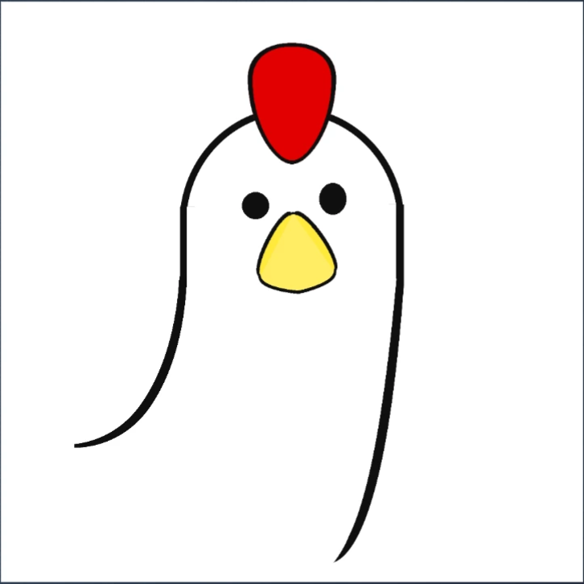

Computer Science undergraduate (Year 3).

Focused on backend and distributed systems.
Daily driver: Linux (Arch).

Tech: Go, C++, Linux, distributed systems.
Tools: CLI-first workflow, VS Code, Helix.

Interested in system design, networking, and building things from scratch.

